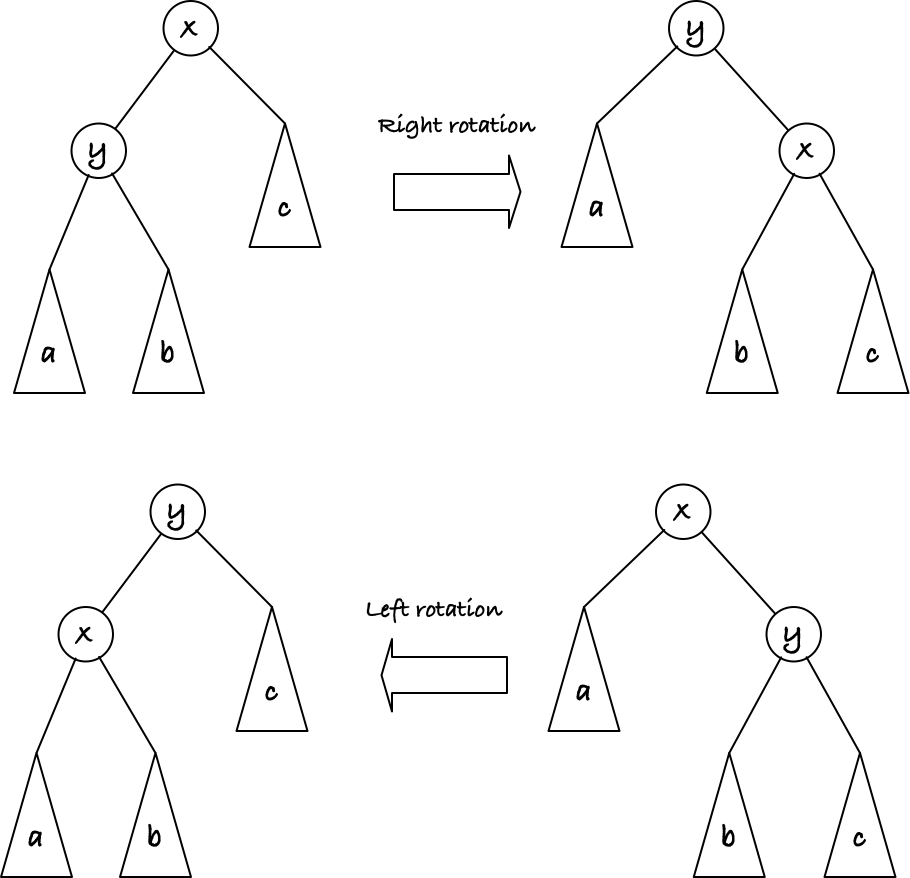
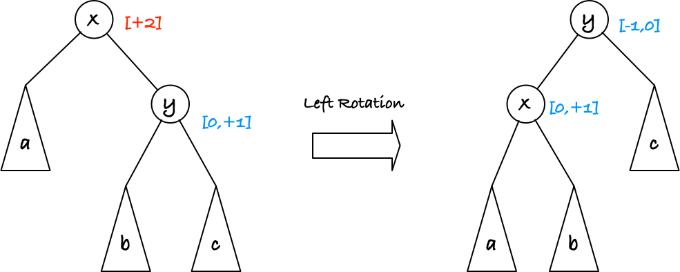
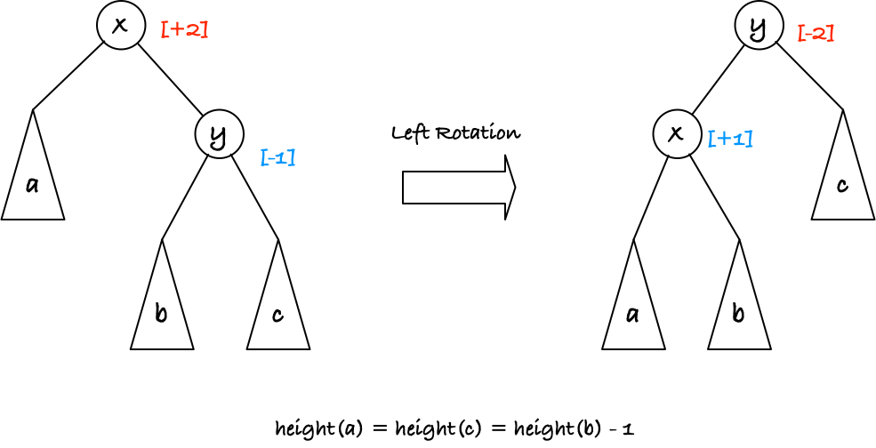
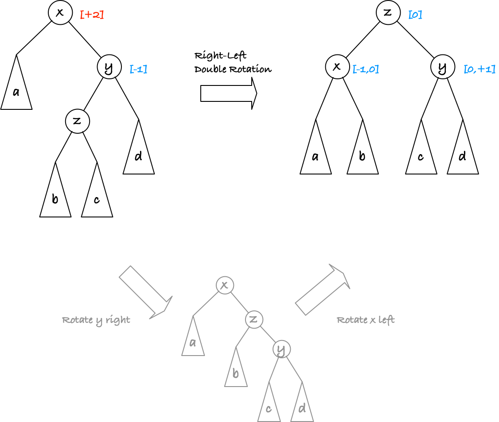

# Balancing search trees -- Persistent

The trick to getting `O(log n)` operations on a binary search tree is to keep the tree balanced, which means that from the root to any leaf, you have the same length. This strict level of ballanced is rarely possible, you can only achieve it if `n` is a power of two, but the best you can achive is that for any node, the longest path to a leaf in one sub-tree is at most one longer than the longest path to a leaf in the other sub-tree.

Even this, though, is rarely achievable, and we have to make do with even looser definitions of balanced. The [Red-black trees](https://en.wikipedia.org/wiki/Red–black_tree) described in the book, for example, guarantees the difference between the longest and the shortest path to a leaf is at most a factor two. Luckily, that also suffices to get logarithmic height.

The way to balance trees is often a local transformation of sub-trees. When inserting or removing elements we transform the tree by locally moving sub-trees around. We will attempt a simple approach to this.

For all trees we define the `height` as the maximal number of nodes we go through to get from the root of the tree to a leaf, where we by leaf mean an empty tree. That means that empty trees have height zero and inner nodes have `height = max(left.height, right.height) + 1`. The difference between the height on the left and on the right we call the `balancing factor` and `bf = right.height - left.height`. A tree `t` that is perfectly balanced has `t.bf == 0`, but we consider any tree with `-1 <= t.bf <= +1` "balanced enough".

A tree with `t.bf < 0` has a longer path on the left than on the right, and we call it *left heavy*, and similarly for `t.bf > 0` we have a longer path on the right and we call the tree *right heavy*. If the tree is left or right heavy with `t.bf <= -2` or `t.bf >= 2`, we need to adjust it. We do this with *rotations*. We have two kinds of these, a left and a right rotation, and what they do is shown in this figure:



**Exercise:** Test that both kinds of rotations keep the search-tree order of nodes preserved, i.e., you never get a larger value to the left of a smaller.

If you do a right rotation, the tree rooted in `y` is lifted up while the rigth child of `x`, tree `c`, is moved down. One approach to balancing could be to do a right rotation whenever the left child is higher than the right child, or put another way whenever `t.bf < -2`, and symmetrically do a left rotation whenever the right child is higher than the left, or `t.bf > 2`.

In `src/st.py` you will find that I have implemented a search tree and I have implemented this strategy.

```python
def rot_left(n: Tree[Ord]) -> Tree[Ord]:
    """Rotate n left."""
    ...


def rot_right(n: Tree[Ord]) -> Tree[Ord]:
    """Rotate n right."""
    ...


def balance(n: Tree[Ord]) -> Tree[Ord]:
    """Re-organize n to balance it."""
    # Simple rotation solution
    if n.bf < -2:  # left-heavy
        return rot_right(n)
    if n.bf > 2:   # right-heavy
        return rot_left(n)
    return n
```

but I would like you to implement the rotations.

**Exercise:** Implement the left and right rotations. In the code in `src/st.py` I have made nodes immutable, to get you to implement a persistent data structure. That means that you cannot modify any node to rotate it; instead you need to compute a new node that reflects the rotation.

This technique almost work, but if you run the tests you might notice that you sometimes end up with a tree that isn't balanced. The problem is that one rotation alone can rearrange the problem of an unbalanced tree from one tree to another without fixing it.

If we have a tree that is right-heavy, for example, its right-child might be balanced or right-balanced itself, and we might have the situation in this figure:



Here, I have put the balance factor in square bracket, comma separated if there are more than one value allowed, and I will generally assume that we are okay with values in `[-1, 0, +1]` but any balance factor outside of these values is one we need to fix.

The figure shows a case where the tree rooted in `x` is right-heavy with factor `+2` and its right child is either balanced or right-heavy with factor `+1`. That meanst that either `b.height = c.height` or `b.height = c.height - 1` and `a.height = c.height - 1`. If we rotate it, the new tree rooted in `x` might be balanced, if `b.height = c.height - 1 = a.height` or might be right-heavy with `+1`, if `b.height = c.height = a.height - 1`. The new root of the tree can have balance factor `-1` if `b.height = c.height` or be balanced, if `b.height = c.height - 1`. This is exactly what we wanted to acheive with the rotations.

However, we could also be in the case where the right child is left-heavy:



Here, rotating the tree just moves the too-heavy tree `b` to another position where it is still too heavy. We change a bad tree with balancing factor `+2` to an equally bad tree with factor `-2`.

When the right child of a right-heavy child is balanced or right-heavy, we are fine; similarly for when a left child of a left-heavy child is balanced or left-heavy. But if the "inner grandchild" is where the heaviness comes from, we need to do more work.

What we can do is rotate the heavy child first and then rotate the root of the tree:



This removes the problem with the bad single rotation.

We have five cases that an updated `balance()` function has to consider. The easy is when `-1 <= n.bf <= +1`, in which case we don't have to do anything. Otherwise, the root node can have `n.bf == -2` or `n.bf == +2` and then we check the inner grandchild to see if it is heavy or not. If it isn't heavy, we do a rotation, as shown in the successful case above, and if it is, we need to do the one just shown in the figure. The two (successful) figures show the cases where we have a right-heavy tree, the two remaining you get by mirroring the figures left-right.

**Exercise:** Write down the two remaining cases where you need to transform the trees.

**Exercise:** Implement a new balancing function that handles the new transformation rules.


Once you have implemented these transformations, you have implemented a data structure called [AVL trees](https://en.wikipedia.org/wiki/AVL_tree). These trees keep the tree height logarithmic, in the sense we have defined above, but not *perfectly* balanced, which would require that the *size* of the left and right sub-trees should be the same (±1), and we only guarantee that the longest path through left and right sub-trees are ±1. Getting the difference in height within one on the left and right is better than what Red-black trees achieve, so if you need to do many lookups in your tree, then AVL trees are likely superior. However, if you need to update the tree often, Red-black trees can be better. Both trees have insertion and deletion in `O(log n)`, but Red-black trees can be implemented with (amortised) constant time rebalancing for both insertion and deletion while AVL trees have amortised constant time insertion but worst-case `O(log n)` deletion. This difference, however, is only seen with ephemeral data structures where we do not need to re-build the tree above an insertion or a deletion, so for the trees we build in this exercise, either balancing technique works equally well.


